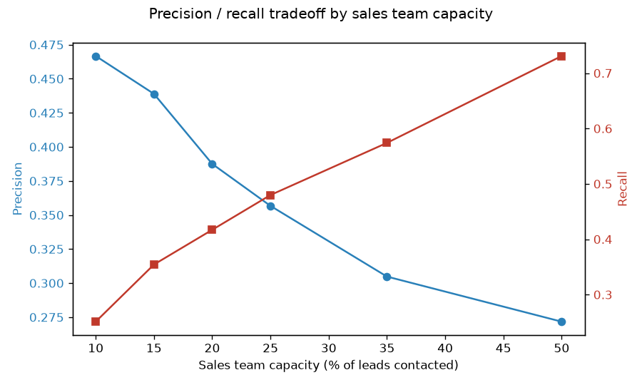

# Lead Scoring — Model + App

A lead-scoring classifier deployed as a real Streamlit app: score a single
lead by hand, upload a CSV to rank a whole batch, or check what
precision/recall your sales team should actually expect at its real
weekly capacity — not just an accuracy number nobody on a sales team would
know what to do with.

**Note on data:** `data/leads.csv` is synthetically generated
(`src/generate_data.py`) from real B2B lead-scoring factors — firmographic
fit (company size, industry), source quality, and behavioral engagement
(email opens, site visits, demo requests, budget confirmation, response
speed) — with a genuine, noisy (not trivially separable) conversion signal
at a realistic 18.6% base rate.

## The part that matters for a sales team: capacity-based thresholds

A model's ROC-AUC (0.70 here — solid, not suspiciously perfect) doesn't
tell a sales manager anything actionable. What does: "if my team can only
call 25% of incoming leads this week, which 25%, and what will we get for
it?"

| Capacity | Leads contacted | Precision | Recall | Lift vs. random |
|---|---|---|---|---|
| Top 10% | 120 | 46.7% | 25.1% | 2.5x |
| Top 15% | 180 | 43.9% | 35.4% | 2.4x |
| Top 20% | 240 | 38.8% | 41.7% | 2.1x |
| **Top 25%** | **300** | **35.7%** | **48.0%** | **1.9x** |
| Top 35% | 420 | 30.5% | 57.4% | 1.6x |
| Top 50% | 600 | 27.2% | 73.1% | 1.5x |

Full table in [`reports/capacity_thresholds.csv`](reports/capacity_thresholds.csv).
At 25% capacity — a realistic number for a small sales team against a busy
lead pipeline — contacting the model's top-scored quarter catches **48% of
actual converters** at **35.7% precision**, against an 18.6% base rate:
nearly **2x lift** over contacting a random 25% of leads.



## The app

```bash
pip install -r requirements.txt
python src/generate_data.py    # writes data/leads.csv
python -m src.train              # trains the model, writes reports/capacity_thresholds.csv
streamlit run app.py              # opens the app at localhost:8501
```

Three tabs:
- **Score one lead** — fill in a form, get a conversion-likelihood score and a contact/no-contact recommendation
- **Score a CSV** — upload a batch of leads, get them ranked and downloadable
- **Capacity guide** — the table above, live from the trained model

### Deploying it live

Not deployed to a public URL as part of this repo (that would mean holding
a hosting account's credentials here). To put it on the public internet:
push this repo to GitHub (already done), then connect it at
[share.streamlit.io](https://share.streamlit.io) — point it at `app.py` and
it deploys directly from the repo, no extra config needed since
`requirements.txt` and `reports/lead_scoring_model.joblib` are already
committed.

## Why `align_columns` exists

`src/data_prep.py::align_columns` solves a real, easy-to-miss bug: one-hot
encoding a *single* new lead only produces dummy columns for the
categories present in that one row — if that lead's source is "Referral,"
there's no `source_Cold outbound` column at all, even though the model was
trained with one. Scoring that row directly against the trained model
would either crash (column mismatch) or, worse, silently misalign columns
and produce a meaningless prediction. `align_columns` reindexes any new
data against the exact column set the model was trained on, filling
anything missing with 0. Covered directly in
[`tests/test_data_prep.py`](tests/test_data_prep.py).

## Project structure

```
app.py                  Streamlit app: single-lead form, batch CSV scoring, capacity guide
src/
  generate_data.py        synthetic lead data with a real, noisy conversion signal
  data_prep.py               feature encoding + the align_columns fix described above
  train.py                    trains the model, computes capacity-based precision/recall
  eda.py                       renders the capacity tradeoff chart
tests/
  test_data_prep.py           feature encoding and column-alignment correctness
reports/
  lead_scoring_model.joblib    the trained model
  capacity_thresholds.csv      the table above
  precision_recall_curve.csv    full precision/recall curve, every threshold
  figures/                       capacity tradeoff chart
.github/workflows/ci.yml     regenerates data, trains, and tests on every push
```
